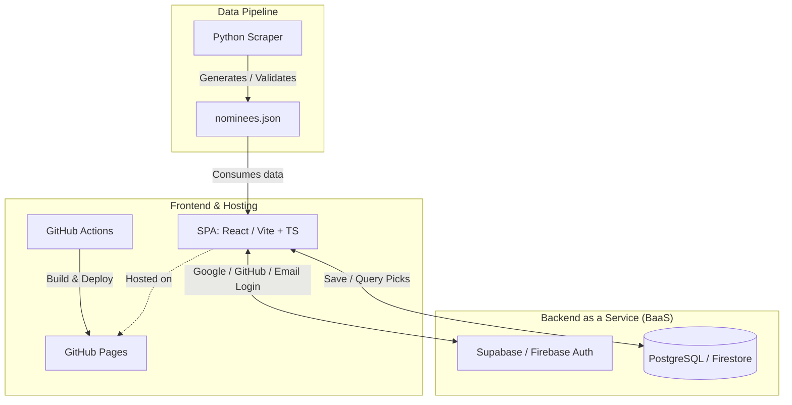
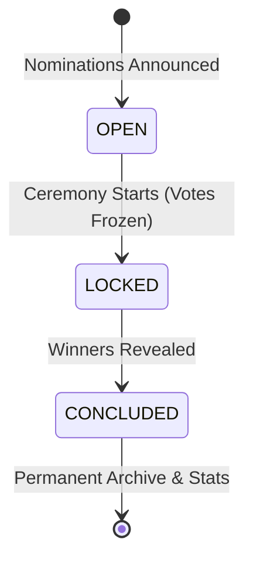

# Project Architecture and Structure - GOTY Picks

This document describes the recommended architecture, directory layout, and data flow for the **GOTY Picks** project.

---

## 1. Architecture Overview

The project adopts a **decoupled JAMstack** architecture with **BaaS (Backend as a Service)** for authentication and data persistence, maintaining zero infrastructure costs and simple operations.



### Core Components
1. **Scraper (Python)**:
   - Extracts categories and nominees from award sources (e.g., The Game Awards).
   - Validates extracted data against a standardized schema (e.g., Pydantic).
   - Generates the `nominees.json` file.
2. **Frontend Web (Vite + React + TypeScript)**:
   - Interactive user interface to view categories, nominees, and submit predictions/picks.
   - Statically hosted via **GitHub Pages**.
3. **Authentication and Database (Supabase / Firebase)**:
   - Handles user authentication (OAuth via Google, GitHub, Discord, or email/password).
   - Securely stores user votes and picks using Row Level Security (RLS) policies.
4. **CI/CD (GitHub Actions)**:
   - Automated pipeline to build and deploy the frontend to GitHub Pages on every push to the `main` branch.
   - Optional scheduled or manual workflow to execute the scraper.

---

## 2. Recommended Directory Structure (Monorepo)

```text
goty-picks/
├── .github/
│   └── workflows/
│       ├── deploy-frontend.yml     # Build frontend and deploy to GitHub Pages
│       └── run-scraper.yml         # (Optional) Scheduled/manual scraper execution
│
├── supabase/                       # Backend as Code (Supabase CLI)
│   ├── migrations/                 # Ordered schema, RLS, RPC, and index changes
│   ├── functions/                  # Optional privileged Edge Functions
│   ├── tests/                      # Database and RLS tests
│   ├── seed.sql                    # Development-only fixtures
│   └── README.md                   # Backend setup and operational guide
│
├── scraper/                        # Python module (data collection)
│   ├── src/
│   │   ├── __init__.py
│   │   ├── crawler.py              # HTTP requests and HTML scraping
│   │   ├── models.py               # Data validation schemas
│   │   └── exporter.py             # Data cleaning and JSON export
│   ├── tests/
│   │   └── test_parser.py          # Unit tests to validate extraction
│   ├── data/
│   │   └── nominees.json           # Locally extracted data
│   ├── main.py                     # Scraper entrypoint
│   ├── requirements.txt            # Dependencies (requests, bs4, pydantic, etc.)
│   └── README.md
│
├── web/                            # Web Frontend
│   ├── public/
│   │   └── data/
│   │       └── nominees.json       # JSON consumed by the application
│   ├── src/
│   │   ├── assets/                 # Global styles, icons, images
│   │   ├── components/             # Reusable UI components
│   │   ├── context/                # Global contexts (Auth, Votes)
│   │   ├── lib/                    # External client configuration (Supabase/Firebase)
│   │   ├── types/                  # TypeScript types
│   │   ├── App.tsx
│   │   └── main.tsx
│   ├── index.html
│   ├── package.json
│   ├── tsconfig.json
│   ├── vite.config.ts
│   └── README.md
│
├── ARCHITECTURE.md                 # This document
├── .gitignore
├── LICENSE
└── README.md                       # General repository documentation
```

---

## 3. Data Contract (`nominees.json`)

To decouple the scraper and the web application, both communicate through a uniform JSON structure:

```json
{
  "year": 2026,
  "lastUpdated": "2026-11-15T18:00:00Z",
  "categories": [
    {
      "id": "game-of-the-year",
      "title": "Game of the Year",
      "nominees": [
        {
          "id": "game-slug-id",
          "name": "Game Name",
          "developer": "Studio Name",
          "imageUrl": "https://...",
          "winner": false
        }
      ]
    }
  ]
}
```

---

## 4. User Data Modeling (BaaS)

### Table: `profiles`
Stores public participant information.
- `id` (UUID, Primary Key, linked to Auth)
- `display_name` (Text)
- `avatar_url` (Text, optional)
- `created_at` (Timestamp)

### Table: `votes`
Stores each individual prediction.
- `id` (UUID, Primary Key)
- `user_id` (UUID, Foreign Key -> `profiles.id`)
- `year` (Integer, e.g., 2026)
- `category_id` (Text, e.g., `"game-of-the-year"`)
- `nominee_id` (Text, e.g., `"game-slug-id"`)
- `updated_at` (Timestamp)

> **Security Rule (RLS)**: Each user can read all predictions once voting closes, but can only insert or modify their own predictions before the event starts.

---

## 5. Multi-Year Lifecycle (2026 Onwards)

To support multiple editions seamlessly, each year transitions through three distinct phases:



| Phase | Description | User Capabilities |
| :--- | :--- | :--- |
| **1. OPEN** | Nominations are published. | Users can create/edit their predictions. Community stats show pick trends (anonymized or hidden until lock). |
| **2. LOCKED** | Voting deadline passed (ceremony begins). | Predictions are frozen. Ballots become public for transparency. Live tracking as awards are announced. |
| **3. CONCLUDED** | All winners are verified. | Full Leaderboard, personal scorecards, and year-end analytics dashboard unlocked. |

### Multi-Year File Structure
Static data is organized per year:
```text
web/public/data/
├── editions.json            # Index of available years and their status (e.g., 2026: "concluded")
├── 2026/
│   └── nominees.json        # Categories, nominees, and confirmed winners for 2026
└── 2027/
    └── nominees.json        # Next edition
```

---

## 6. Post-Ceremony Statistics & Insights Dashboard

Once an edition reaches the `CONCLUDED` status, a dedicated **Year Statistics & Leaderboard** page unlocks with the following modules:

### A. Personal Scorecard
- **Overall Score & Hit Rate**: Total points and correct picks (e.g., `24 / 31 categories - 77.4% accuracy`).
- **Percentile Rank**: E.g., *"Top 3% among 1,420 predictors"*.
- **Category-by-Category Diff**: Visual card showing user's pick vs. actual winner (with green/red status badges).

### B. Global Leaderboard
- **Rankings**: Position, user avatar/display name, total score, and accuracy percentage.
- **Tie-breakers**: Correct GOTY pick, followed by earliest submission timestamp.
- **Search & Share**: Filter by username and generate a shareable image/card of the user's final score.

### C. Community "Wisdom of the Crowd" Analytics
- **Biggest Upset of the Night**: The category where the community favorite lost (e.g., *74% picked Game X, but Game Y won with only 6%*).
- **Consensus Accuracy**: Overall percentage of categories where the #1 community pick actually won.
- **Most Contested Category**: The category with the most split vote distribution (e.g., 3-way tie at ~28% each).
- **The "Safest Bet"**: Category with highest unanimous community consensus (e.g., 93% agreed on the winner).
- **Dark Horse Pick**: The winner that the fewest people saw coming.

### D. Game & Studio Award Counts
- **Leaderboard of Games**: Top winning games (actual wins vs. predicted wins).
- **Publisher / Studio Tally**: Comparison of awards by studio/publisher.

---

## 7. Supabase Backend Structure and Governance

Supabase is managed as **Backend as Code** within `supabase/`. The directory
contains versioned PostgreSQL changes, Row Level Security policies, database
tests, and optional server-side functions. The Supabase Dashboard may be used
for observability and hosted-project configuration, but no schema or security
change should exist only in the dashboard.

```text
supabase/
├── config.toml                     # Supabase CLI configuration; no secrets
├── migrations/
│   ├── <timestamp>_extensions.sql
│   ├── <timestamp>_profiles.sql
│   ├── <timestamp>_editions.sql
│   ├── <timestamp>_votes.sql
│   ├── <timestamp>_rls_policies.sql
│   ├── <timestamp>_rpc_statistics.sql
│   └── <timestamp>_indexes.sql
├── functions/                      # Optional Edge Functions with server secrets
├── tests/                          # RLS, trigger, constraint, and RPC tests
├── seed.sql                        # Fixtures exclusively for local development
└── README.md                       # Detailed developer and deployment guide
```

`supabase/supabase_schema.sql` is retained only as a legacy bootstrap reference.
The active implementation is the timestamped migration set. Database history is
append-only: create a new migration for each change and never alter a migration
already applied to a shared environment.

### 7.1 Trust Boundary and Lifecycle Enforcement

The scraper remains the source of public editorial data—categories, nominees,
winners, and images—and synchronizes it to `web/public/data/`. This static JSON
is not an authorization source. Supabase holds the minimum authoritative data
needed to enforce voting rules:

### Table: `editions`

- `year` (Integer, Primary Key)
- `status` (Enum/check: `open`, `locked`, `concluded`)
- `votes_close_at` (Timestamp with time zone)
- `created_at` and `updated_at` (Timestamp with time zone)

Only an administrative, trusted path can update an edition lifecycle record.
Policies for `votes` consult `editions`, making the lock effective even if a
user manipulates the client clock, request payload, or frontend code.

### 7.2 Required RLS Design

- `profiles`: a user updates only `auth.uid() = id`. Reads expose only public
  profile data needed by leaderboard screens.
- `votes`: a user writes only rows where `user_id = auth.uid()`, and only while
  the matching edition is `open` and before `votes_close_at`.
- `votes` reads: individual ballots remain hidden (or only approved aggregates
  are exposed) during `open`; ballots can be public from `locked` onward.
- `editions`: normal browser sessions have no insert, update, or delete access.
- Statistics: scorecards, rankings, and community distribution use constrained
  SQL views or RPC functions instead of transferring all vote rows to React.

Any `SECURITY DEFINER` function must set a safe `search_path`, validate inputs,
return only intended data, and grant execute only to the required roles.

The existing schema allows public vote reads and allows owners to write at any
time. It must be replaced by lifecycle-aware policies when migrated into
`supabase/migrations/` to meet the voting rules defined above.

### 7.3 Frontend Boundary and Secrets

The static frontend uses a single Supabase client in `web/src/lib/supabase.ts`.
Its local configuration is limited to these public values:

```dotenv
VITE_SUPABASE_URL=https://<project-ref>.supabase.co
VITE_SUPABASE_ANON_KEY=<publishable-anon-key>
```

These variables may be bundled by Vite; their safety depends on RLS. The
`service_role` key bypasses RLS and must never be committed, included in GitHub
Pages, or exposed to a browser. It belongs only in protected server/CI secrets
or Edge Function secrets.

Generate database types after schema changes into
`web/src/types/database.types.ts`; do not edit generated types manually.
The detailed local setup, migration workflow, data model, and test checklist are
maintained in [`supabase/README.md`](supabase/README.md).
