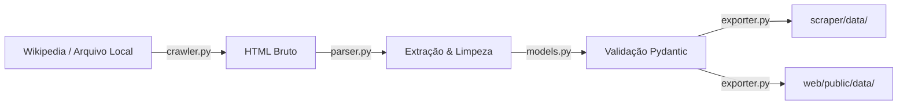

# GOTY Picks - Data Scraper 🎮

Módulo em Python para extrair, validar e exportar dados de categorias, indicados e vencedores de todas as edições do **The Game Awards (2014 até o presente)** a partir da Wikipédia.

---

## 📌 Sumário
- [Visão Geral](#-visão-geral)
- [Estrutura do Módulo](#-estrutura-do-módulo)
- [Como Funciona](#-como-funciona)
- [Instalação e Configuração](#-instalação-e-configuração)
- [Como Usar (CLI)](#-como-usar-cli)
- [Estrutura dos Dados Exportados](#-estrutura-dos-dados-exportados)
- [Testes Automatizados](#-testes-automatizados)
- [Tratamento de Casos Especiais](#-tratamento-de-casos-especiais)

---

## 🎯 Visão Geral

Este scraper foi construído para alimentar a plataforma **GOTY Picks** com dados históricos e atuais do *The Game Awards*.

Ele resolve os seguintes desafios:
- Extração de páginas completas do Wikipedia pt-BR com cabeçalho `User-Agent` customizado e respeitoso.
- Tratamento da marcação do MediaWiki (listas aninhadas onde o vencedor `<b>` encabeça a lista e os demais indicados ficam em `<ul>` filhos).
- Separação inteligente entre título do indicado e estúdio/produtora/papel (ex: `"Clair Obscur: Expedition 33 – Sandfall Interactive / Kepler Interactive"`).
- Detecção automática de vencedores através de cruz dupla (`‡`), cruz simples (`†`) ou texto em negrito.
- Validação estrutural de todos os dados via **Pydantic**.
- Sincronização automática dos arquivos JSON com a pasta estática do frontend (`web/public/data/`).

---

## 📁 Estrutura do Módulo

```text
scraper/
├── src/
│   ├── __init__.py         # Pacote Python
│   ├── crawler.py          # Cliente HTTP com retentativas, headers e fallback para arquivos locais
│   ├── models.py           # Schemas Pydantic (Nominee, Category, Edition, EditionSummary)
│   ├── parser.py           # Extração BeautifulSoup, remoção de notas [x], slugify e separação de texto
│   └── exporter.py         # Exportação para JSON e sincronização com web/public/data/
├── tests/
│   └── test_scraper.py     # Testes unitários com unittest
├── examples/               # Exemplos de páginas HTML salvas offline (2025, página principal) e screenshots
├── data/                   # Arquivos JSON gerados localmente pelo scraper
│   ├── editions.json       # Manifesto com todas as edições disponíveis
│   ├── 2024/
│   │   └── nominees.json   # Dados detalhados da edição 2024
│   └── 2025/
│       └── nominees.json   # Dados detalhados da edição 2025
├── main.py                 # Entrypoint de linha de comando (CLI)
├── requirements.txt        # Dependências do projeto
└── README.md               # Esta documentação
```

---

## ⚙️ Como Funciona



1. **Crawler (`src/crawler.py`)**: Realiza requisições HTTP seguras ou lê arquivos salvos em `examples/`. Trata erros de conexão e identifica rapidamente quando uma edição futura ainda não tem página criada (HTTP 404).
2. **Parser (`src/parser.py`)**:
   - Identifica tabelas `wikitable` de premiações (descartando tabelas de contagem de indicações ou apresentadores).
   - Limpa caracteres especiais, referências (`[12]`, `[d]`) e o símbolo de vencedor (`‡`).
   - Normaliza nomes e títulos gerando slugs amigáveis (ex: `"Jogo do Ano"` $\to$ `"jogo-do-ano"`).
3. **Models (`src/models.py`)**: Garante que nenhum dado saia sem tipagem válida (`Nominee`, `Category`, `Edition`).
4. **Exporter (`src/exporter.py`)**: Salva o `nominees.json` no scraper e atualiza automaticamente o frontend em `web/public/data/{year}/nominees.json` e o `editions.json`.

---

## 🚀 Instalação e Configuração

### Pré-requisitos
- Python 3.10 ou superior (testado com Python 3.14).

### 1. Criar e ativar ambiente virtual (recomendado)
No terminal, dentro da pasta `scraper/`:

**No Windows (PowerShell):**
```powershell
python -m venv .venv
.\.venv\Scripts\Activate.ps1
```

**No Linux / macOS:**
```bash
python3 -m venv .venv
source .venv/bin/activate
```

### 2. Instalar dependências
```bash
pip install -r requirements.txt
```

As dependências principais são:
- `requests`: Requisições HTTP com suporte a sessões e headers customizados.
- `beautifulsoup4`: Análise e navegação pelo DOM HTML.
- `pydantic`: Modelagem e validação de tipos de dados.

---

## 💻 Como Usar (CLI)

O arquivo `main.py` oferece uma interface de linha de comando flexível:

### A. Extrair uma edição específica (ao vivo)
Extrai os dados de um ano diretamente da Wikipédia:
```bash
python main.py --year 2024
```

### B. Extrair todas as edições históricas (2014 até o presente)
Descobre automaticamente todos os anos listados na página principal da Wikipédia e extrai um a um com intervalo de cortesia:
```bash
python main.py --all --delay 1.5
```

### C. Modo Offline / Local (usando arquivos de exemplo)
Você pode rodar o scraper sem internet usando o arquivo HTML de exemplo salvo em `examples/`:
```bash
python main.py --local "examples/The Game Awards 2025 – Wikipédia, a enciclopédia livre.html" --local-year 2025
```

### D. Opções adicionais
- `--output-dir <caminho>`: Define pasta personalizada para os JSONs (padrão: `scraper/data`).
- `--no-sync-web`: Desativa a cópia automática para a pasta do frontend `web/public/data`.
- `--delay <segundos>`: Intervalo de espera entre requisições (padrão: `1.0s`).

---

## 📄 Estrutura dos Dados Exportados

### 1. `nominees.json` (Exemplo: `data/2025/nominees.json`)
```json
{
  "year": 2025,
  "title": "The Game Awards 2025",
  "status": "concluded",
  "last_updated": "2026-09-05T16:51:04.502238+00:00",
  "categories_count": 30,
  "categories": [
    {
      "id": "jogo-do-ano",
      "title": "Jogo do Ano",
      "nominees": [
        {
          "id": "clair-obscur-expedition-33",
          "name": "Clair Obscur: Expedition 33",
          "details": "Sandfall Interactive / Kepler Interactive",
          "winner": true,
          "image_url": null
        },
        {
          "id": "death-stranding-2-on-the-beach",
          "name": "Death Stranding 2: On the Beach",
          "details": "Kojima Productions / Sony Interactive Entertainment",
          "winner": false,
          "image_url": null
        }
      ],
      "winner_id": "clair-obscur-expedition-33"
    }
  ]
}
```

### 2. `editions.json` (Manifesto de edições)
```json
[
  {
    "year": 2025,
    "title": "The Game Awards 2025",
    "status": "concluded",
    "categories_count": 30,
    "has_winners": true,
    "url": "https://pt.wikipedia.org/wiki/The_Game_Awards_2025"
  },
  {
    "year": 2024,
    "title": "The Game Awards 2024",
    "status": "concluded",
    "categories_count": 32,
    "has_winners": true,
    "url": "https://pt.wikipedia.org/wiki/The_Game_Awards_2024"
  }
]
```

---

## 🧪 Testes Automatizados

O scraper conta com suíte de testes unitários que valida slugificação, remoção de referências, separação de nomes e o parsing completo do HTML do TGA 2025:

Para executar os testes:
```bash
python -m unittest discover tests
```

Saída esperada:
```text
....
----------------------------------------------------------------------
Ran 4 tests in 0.210s

OK
```

---

## 🛡️ Tratamento de Casos Especiais

1. **Edições futuras ainda não criadas (ex: 2026 antes de novembro/dezembro)**:
   - Se a página retornar HTTP 404, o crawler não faz retentativas desnecessárias e emite um aviso informativo claro, encerrando sem falhas catastróficas.
2. **Listas com Vencedor no topo vs. sem Vencedor**:
   - Se houver vencedores (`‡` ou tags `<b>`), a categoria é salva com `status: "concluded"` e `winner_id` preenchido.
   - Quando as indicações são recentes e a premiação ainda não ocorreu, o scraper marca `winner: false` para todos e `status: "open"`.
3. **Múltiplos formatos de travessão**:
   - Suporta meia-risca (`–`), travessão (`—`) e hífen tradicional (`-`) na separação entre o título da obra e o desenvolvedor.